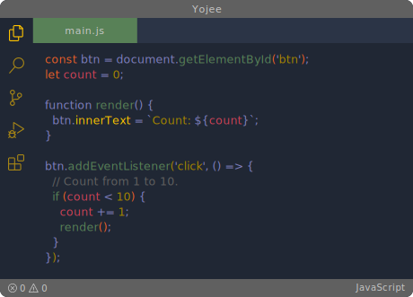

 ### Lexus theme [Live](https://vscodethemes.com/e/yoko-luxelego.yojee/yojee?language=javascript) preview.

. . . . . . . . . . . . . . . . . . . . . . . . . . . . . . . . . . . . . . . . . . . . . . . . . . . . . . . 

### Install using VSCode [Marketplace](https://marketplace.visualstudio.com/items?itemName=Yoko-Luxelego.yojee)

1. Enter VSCode [Marketplace](https://marketplace.visualstudio.com/items?itemName=Yoko-Luxelego.yojee)
2. Search for `Lexus Theme`

You can easily install the **Yojee Theme** by using the **Command Palette**:

1. Go to View -> `Command Palette`
2. Enter `Install Extension`
3. Write `Lexus Theme`
4. Select it or press Enter to install

### Activating the Lexus Theme

1. Click the `gear button` in the lower left corner.
2. Click `Color Theme`.
3. Select **Lexus Theme** in the list.